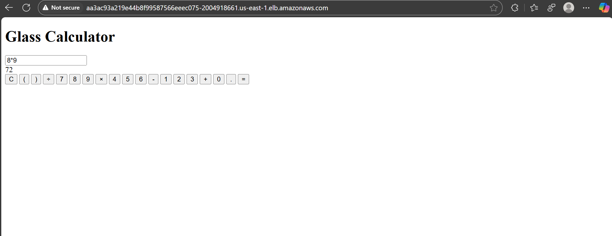
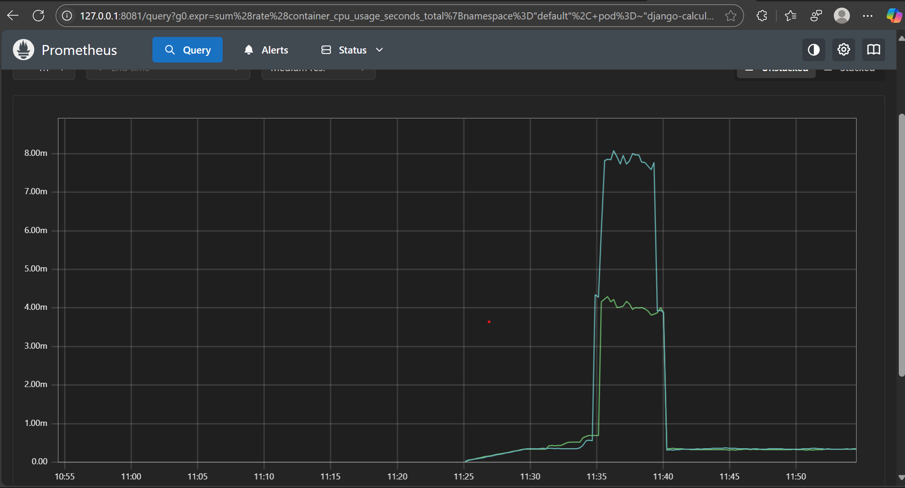
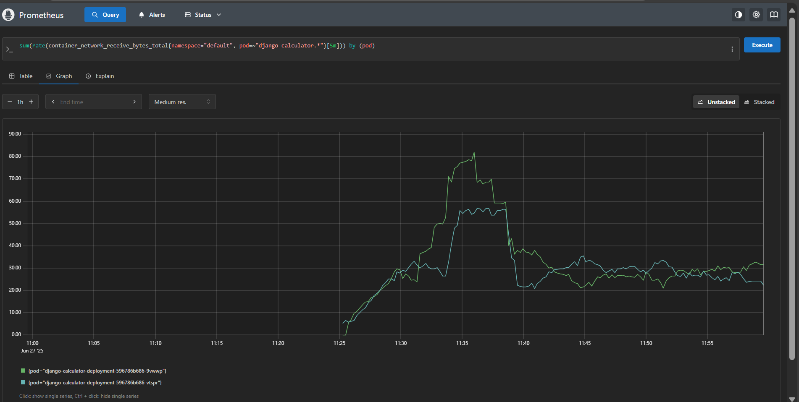
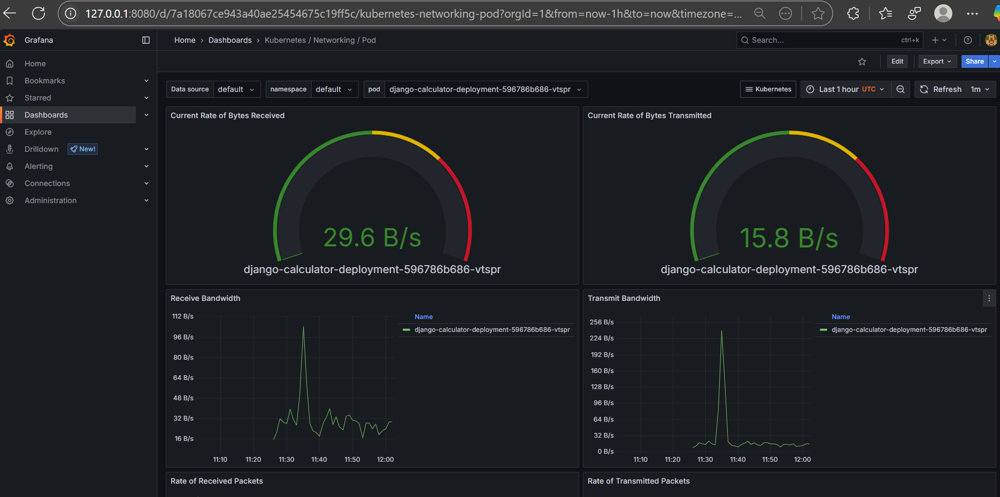

# Django Calculator App – Full CI/CD with Jenkins, Docker, AWS ECR → EKS, plus Prometheus & Grafana Monitoring

Project Summary:

This project showcases a complete DevOps workflow for a Dockerized Django calculator application:

CI/CD with Jenkins:

A declarative Jenkinsfile checks out the source from GitHub, builds the Docker image, and securely pushes each tagged build to AWS Elastic Container Registry (ECR).

Container Orchestration with EKS:

The versioned image is deployed to an AWS Elastic Kubernetes Service (EKS) cluster via Kubernetes manifests/Helm, and exposed publicly through a LoadBalancer-type service.

Observability:

Prometheus (deployed through Helm charts) scrapes  cluster metrics.

Grafana renders real-time dashboards to visualize performance, resource usage, and availability.

Together, the pipeline delivers hands-free builds, automated container promotion, scalable Kubernetes deployment, and production-grade monitoring

Step 0: Build and Run with Docker Locally
This step confirms that your Docker setup is working correctly before you push to AWS.

Ensure Docker is Running: Make sure the Docker Desktop application is open and running on your system.

Build the Docker Image: From the root of your django-calculator-project directory, run the build command.

```console
docker build -t django-calculator .
```

Run the Docker Container: Once the build is complete, run the container. This command maps port 8000 on your local machine to port 8000 inside the container.

```console
docker run -p 8000:8000 django-calculator
```

Test the App: Open your web browser and navigate to http://localhost:8000. You should see your calculator application running!

After testing commit to the Github repository

Step 1: Create a Jenkins Server

•	Set up a running Jenkins instance on an EC2 instance with the AmazonEC2ContainerRegistryPowerUser IAM policy attached.

•	Follow the official Jenkins documentation to install and configure Jenkins.

Required Jenkins Plugins:

•	GitHub Integration (or Git plugin)
•	Docker Pipeline
•	AWS Steps
Docker Installation (on Jenkins server):

```console
sudo apt-get update
sudo apt-get install -y docker.io
sudo usermod -aG docker jenkins # Add Jenkins user to Docker group
sudo systemctl enable docker
sudo systemctl start docker
sudo systemctl restart jenkins # Restart Jenkins after adding user to Docker group
```

Step 2: Prepare GitHub Repository

Your GitHub repository should contain:
•	Django application code
•	A Dockerfile
•	A Jenkinsfile

Create ECR Repository Using AWS CLI:

```console

aws ecr create-repository --repository-name django-calculator-app --region us-east-1
Note down your repositoryUri from the output. It will look like:
<aws_account_id>.dkr.ecr.<your-aws-region>.amazonaws.com/django-calculator-app
```

Step 3: Create and Configure Jenkins Pipeline

1.	Log in to Jenkins.
2.	On the dashboard, click "New Item" (or "Create a Job").
3.	Enter an item name (e.g., Django-App-ECR-Pipeline).
4.	Select "Pipeline" and click OK.
5.	On the configuration page:

	Build Triggers:
	For automatic builds on push: check "GitHub hook trigger for GITScm polling"
	
    Or Just copy the script in jenkinsfile it will automatically clone the repo and build the image

6.	Click Save.
Step 4: Run the Jenkins Pipeline
1.	On the pipeline’s Jenkins job page, click "Build Now"

2.	Monitor the build progress in the Build History section.

Click a build number, then "Console Output" to view logs.


If all steps were successful, your containerized Django application is now stored in your private AWS ECR repository. From here, we can use it in other AWS services like ECS (Elastic Container Service) or EKS (Elastic Kubernetes Service) to deploy and run your application at scale.

Deploying django calculator application into Amazon EKS

Prerequisites
Before you start, you must have the following command-line tools installed and configured on your machine:
•	kubectl: The Kubernetes command-line tool.
•	eksctl: The official CLI for creating EKS clusters.

Step 1: Create the EKS Cluster
Now, we'll provision the Kubernetes cluster itself using eksctl. This command creates all the necessary resources (VPC, subnets, EC2 instances for nodes, etc.) automatically.

```console
eksctl create cluster --name django-calc-cluster --region us-east-1 --nodegroup-name standard-workers --node-type t3.medium --nodes 2 --nodes-min 1 --nodes-max 3

```
•	--name: The name for your cluster.
•	--region: The same AWS region you used for ECR.
•	--node-type: The EC2 instance size for your worker nodes. t3.medium
•	--nodes 2: Starts the cluster with 2 worker nodes.

Check the worker nodes

```console
kubectl get nodes
```

you should see the worker nodes

Step 2: Deploy Your Application to EKS

Check the deployment and service manifest files in the repository

With the manifest files created, you can now apply them to your cluster.

1.	Apply the Deployment:

	```console
    kubectl apply -f deployment.yaml
    
    ```
2.	Apply the Service:

	```console
    kubectl apply -f service.yaml
    ```

3.	Check the Status: You can monitor the rollout of your deployment.

	```console
    kubectl get deployment django-calculator-deployment
        kubectl get pods
    ```

Wait until you see that 2/2 pods are Running

Step 3: Access Your Application

Get the Load Balancer URL:

```console
kubectl get service django-calculator-service

```
Access the App: Copy that EXTERNAL-IP address and paste it into your web browser. You should see your Django calculator application,
 Eg: xxxxxxxxxx.elb.amazonaws.com

# Monitor Your AWS EKS Cluster Health with Prometheus and Grafana Using Helm

Installing and configuring Prometheus and Grafana on your Amazon EKS (Elastic Kubernetes Service) cluster for monitoring node health, specifically CPU and memory usage. 

Prerequisites.

•	Helm, the package manager for Kubernetes, installed on your local machine.

Step 1: Add the Prometheus Community Helm Repository
First, you need to add the Prometheus community Helm repository, which hosts the kube-prometheus-stack chart. This chart bundles Prometheus, Grafana, and other necessary components for a complete monitoring setup.
Open your terminal and execute the following commands:
```console

helm repo add prometheus-community https://prometheus-community.github.io/helm-charts
helm repo update

```
Install Prometheus and Grafana 

```console
helm install prometheus-stack prometheus-community/kube-prometheus-stack --namespace monitoring --create-namespace
```
This command will install the Helm chart with its standard, default configuration. The pods will be running inside your cluster, we can  connect to them using port-forward.

Wait for the pods to start: Check their status until they are Running.

```console
kubectl get pods -n monitoring
```

Get the exact name of the pod you want to connect to (e.g., Prometheus pod ,Grafana pod).

# This will list the pods, find the pods 
eg: prometheus-prometheus-stack-kube-prom-prometheus-0       2/2     Running   0          11m
prometheus-stack-grafana-68f5c7c668-vfrr9

```console
kubectl get pods -n monitoring
```

Use kubectl port-forward to connect your local machine to the pod. For example, to connect to the Prometheus and Grafana pod:

 # Replace <prometheus-pod-name> with the real name from the previous command

```console
kubectl port-forward -n monitoring <prometheus-pod-name> 8080:9090
```

# Replace <grafana-pod-name> with the real name from the previous command

```console
kubectl port-forward -n monitoring <grafana-pod-name> 8080:3000
```

Access Prometheus and  Grafana in your browser at 
	http://localhost:8080.
	http://localhost:8081


We can execute the promql command to check the metrics or graph on prometheus

```console
sum(rate(container_cpu_usage_seconds_total{namespace="default", pod=~"django-calculator-deployment-.*"}[5m])) by (pod)

sum(rate(container_network_receive_bytes_total{namespace="default", pod=~"django-calculator-deployment-.*"}[5m])) by (pod)

```
We can monitor the network traffic and cpu usage
In Grafana we can get detailed dashboard

Output

Django App



Prometheus Graph






Grafana Dashboard




Cleanup

To avoid incurring ongoing AWS charges, you must delete the resources you created.

Delete the Cluster and its Nodes: The easiest way is with eksctl. This will delete the EKS cluster and all associated resources like the EC2 nodes and the Load Balancer.

```console
eksctl delete cluster --name django-calc-cluster --region <your-aws-region>

```


Delete the ECR Repository (Optional): If you no longer need the Docker image, you can delete the ECR repository from the AWS Console.


